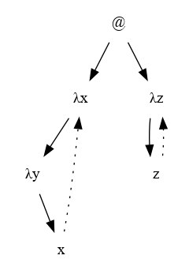
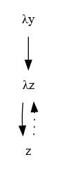

# AChurch - MValls Bot

AChurch - MValls Bot is a Telegram bot that acts as a lambda calculator. 

It allows you to input λ-calculus expressions and performs reduction steps to simplify them. 

The bot is built using the Python programming language and relies on the python-telegram-bot library.

## Author

Marc Valls Camps (LP12)

## Usage

1. Follow the Installation and Setup instructions below.
2. Start a chat with the AChurch - MValls Bot on Telegram.
3. Send λ-calculus expressions as messages to the bot.
4. The bot will respond with reduction steps and the simplified result.

## Commands

- `/start`: Start the bot and receive a welcome message.
- `/help`: Get information on how to use the bot.
- `/macros`: View the defined macros and their corresponding λ-calculus expressions.
- `/author`: Learn about the author of the bot.

## Example

Here you can find an example on how the bot responds to queries:

Input:
```bash
(\x.\y.x) (\z.z)
```

Output:
```bash
Arbre:
((λx.(λy.x))(λz.z))
```



```bash
β-reducció:
((λx.(λy.x))(λz.z)) →  (λy.(λz.z))
```

```bash
Resultat:
(λy.(λz.z))
```



## Installation and Setup

To run the AChurch - MValls Bot locally, follow these steps:

1. Clone the repository: `git clone git@github.com:mvalls21/AChurch.git`
2. Install the required dependencies: `pip install python-telegram-bot`
3. Create a new Telegram bot and obtain the API token. You can follow the official Telegram Bot documentation for more information.
4. Create a file named `token.txt` in the project root directory and paste your API token into it.
5. Run the bot: `python3 achurch.py`

## Dependencies

- Python 3.7 or higher
- python-telegram-bot
- graphviz, pydot

## Implementation details

Although the code has already been commented strategically inline, this is a brief recap.

- Five basic Telegram callbacks have been implemented, four of them serving commands and the last one processing lambda expressions.
- There exists a grammar `lc.g4` used to parse and tokenize expressions, and just one visitor that converts these tokens to a class hierachy.
- The code is heavily object oriented, having an interface class Term and another three classes Letter, Application and Abstraction implementing it.
- One beta reduction and its necessary alpha conversions are performed by the call `reduce()`. Up to ten beta reductions will be performed per expression.
- Through OOP a graph is built, and a corresponding image is created before outputing it to the Telegram chat

Find more details, such as the conditions considered to perform an alpha conversion, within the code in `achurch.py`
